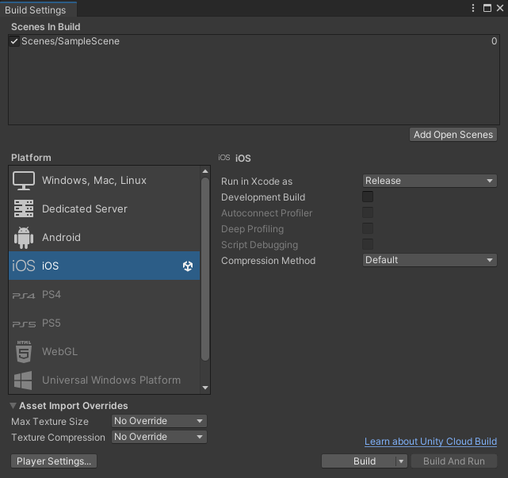
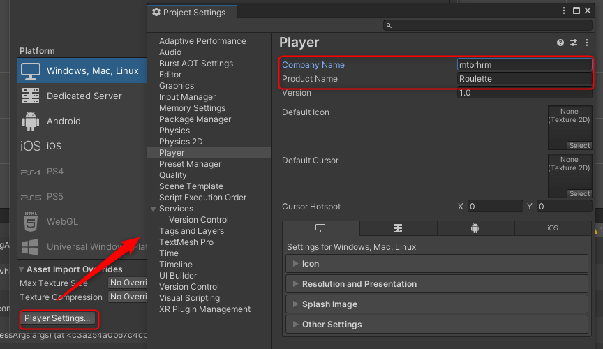
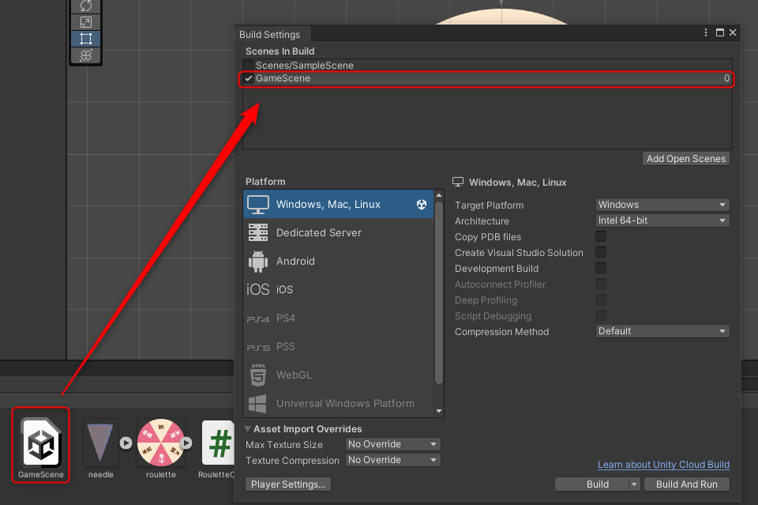
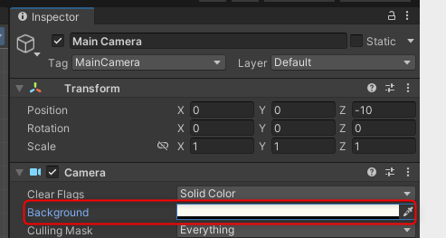
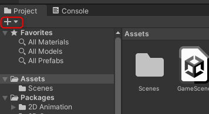
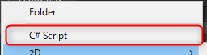
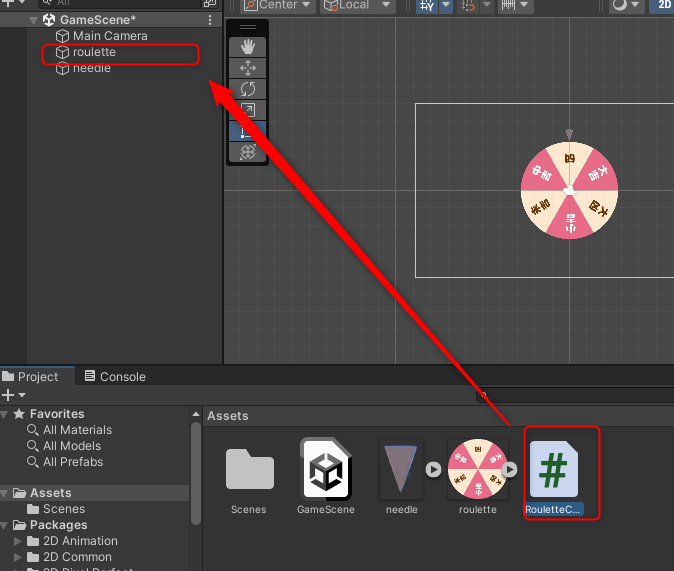
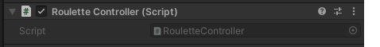
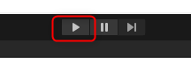

# Study-of-Unity-2D

# Gitでの管理方法
1.Unityの設定
Edit > Project Settings > Editor で以下の設定をする
Version Control: Visible Meta Files
Asset Serialization:Force Text

metaファイル…Assetフォルダ内の全アセットに対してUnityで必要な管理情報が記述されるファイル．これを見れるようにする
Force Text…アセットをテキスト形式に変換．バージョン管理しやすくなる．

2.Git ignore
https://github.com/github/gitignore/blob/main/Unity.gitignore

3.Git Push
VSCodeでGitPushする

# ビルド方法
## スマートフォン用にビルドする
File>Build Setting
Platform選択後，SwitchPlatformを押す

## Windows用にビルドする
File>Build Setting
でWindows/Mac/Linuxを選択

PlayerSettingで「Company Name」と「Product Name」を入力する．

ScenesInBuildにビルド対象のシーンをD＆Dでチェックを入れる．
BuildAndRunを実行．保存先は空フォルダでないとビルドエラーになる．

# 背景色の設定方法
カメラを選択し，InspectorからBackgroundを変更

# スクリプトの作成
プロジェクトウィンドウ「＋」ボタン＞C#Scriptを選択

# VisualStudio2022で編集
Edit>Preference>External Tools>External Script Editorで「VS2022」を選択

# Script
## アタッチ
C#Scriptをオブジェクトにアタッチさせる方法
アタッチしたいスクリプトをオブジェクトにD＆D

オブジェクトがアタッチされたかの確認方法

## デバッグ方法
「▶」を押下する．
停止するときは再度「▶」を押下する．

## フレームレート
どの性能のOSでも同じ速度で動かしたい場合

~~~C#
    void Start()
    {
        Application.targetFrameRate = 60;
    }
~~~

Q.なぜフレームレートを統一させるのか？
A.OSによってフレームレートが異なる．
スマートフォンの場合：60fps
高速なPCの場合：300fps
Update処理で右に1ずつ動かす処理を記入した場合，スマートフォンでは+60の位置，高速なPCでは+300の位置になり，OSによって移動量に差が発生してしまう．

## マウス
マウスが押されているかの判定．マウスがクリックされた瞬間に一度だけtrueを返す．
＊スマートフォンの場合はタッチに該当する

~~~C#
if (Input.GetMouseButtonDown(0)){   // 0:左クリック，1:右クリック，2:中クリック
  // 処理
}
~~~

マウスが離れた瞬間にtrueを返す

~~~C#
if (Input.GetMouseButtonUp(0)){   // 0:左クリック，1:右クリック，2:中クリック
  // 処理
}
~~~

マウスが押されている間ずっとtrueを返す．

~~~C#
if (Input.GetMouseButtonUp(0)){   // 0:左クリック，1:右クリック，2:中クリック
  // 処理
}
~~~

## オブジェクト
### 回転

~~~C#
transform.Rotate(0, 0, _rotationSpeed);   // 引数：X，Y，Z軸の回転スピード
~~~

# トラブルシューティング
## スクリプトをVisualStudioで開こうとするとサポート外といわれる
[現象]
スクリプトをVisualStudioで開こうとするとサポート外といわれる

[原因]
VisualStudioでUnityのツールがインストールされていない

[解決策]
VisualStudioInstallerでUnityのツールをインストールする